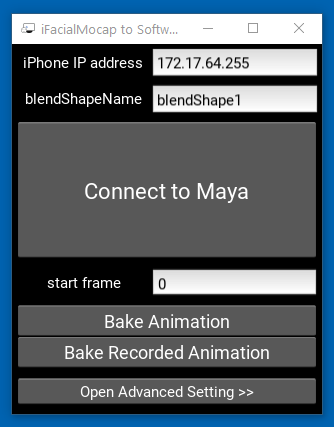
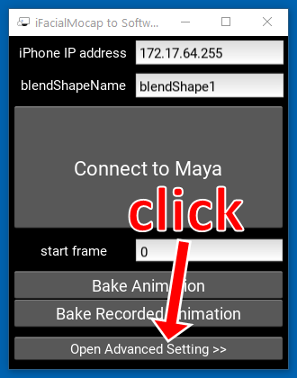
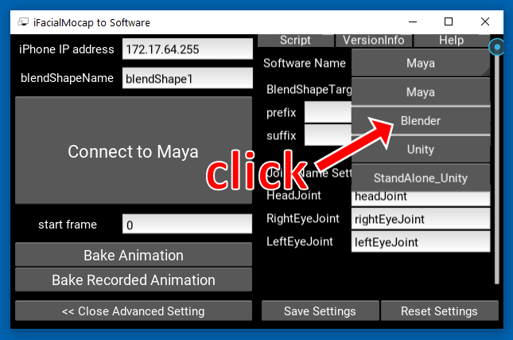
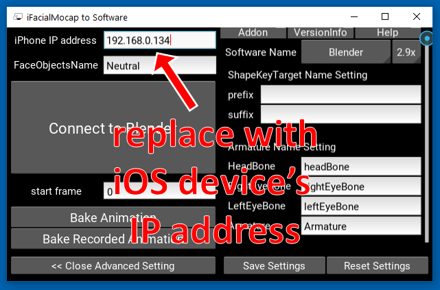
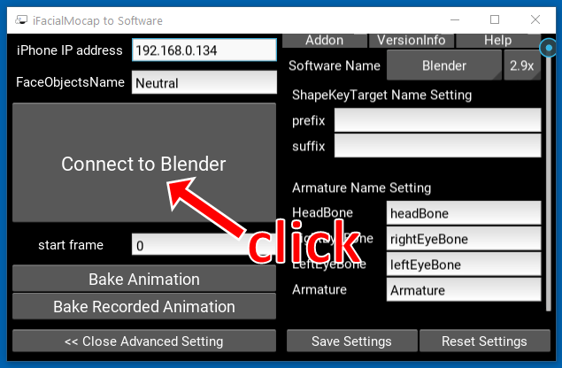
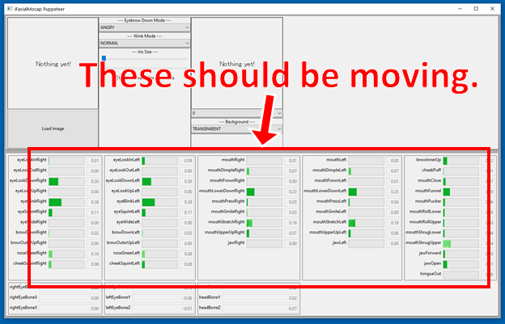
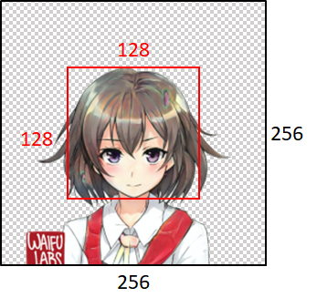

# Demo Code for "Talking Head Anime from a Single Image 2: More Expressive"

This repository contains demo programs for the [Talking Head Anime from a Single Image 2: More Expressive](http://pkhungurn.github.io/talking-head-anime-2) 
project. Similar to the [previous version](http://github.com/dragonmeteor/talking-head-anime-demo), it has two programs:

  * The `manual_poser` lets you manipulate the facial expression and the head rotation of an anime character, given in 
    a single image, through a graphical user interface. The poser is available in two forms: a standard GUI application,
    and a [Jupyter notebook](https://jupyter.org/).
  * The `ifacialmocap_puppeteer` lets you transfer your facial motion, captured by a commercial iOS application 
    called [iFacialMocap](http://www.ifacialmocap.com), to an image of an anime character.

## Try the Manual Poser on Google Colab

If you do not have the required hardware (discussed below) or do not want to download the code and set up an environment to run it, click [](https://colab.research.google.com/github/pkhungurn/talking-head-anime-2-demo/blob/master/colab.ipynb) to try running the manual poser on [Google Colab](https://research.google.com/colaboratory/faq.html).

    
## Hardware Requirements

Both programs require a recent and powerful Nvidia GPU to run. I could personally ran them at good speed with the 
[Nvidia Titan RTX](https://www.nvidia.com/en-us/deep-learning-ai/products/titan-rtx/). However, I think recent high-end
gaming GPUs such as the [RTX 2080](https://www.nvidia.com/en-us/geforce/graphics-cards/rtx-2080/), the 
[RTX 3080](https://www.nvidia.com/en-us/geforce/graphics-cards/30-series/rtx-3080/), or better would do just as well. 

The `ifacialmocap_puppeteer` requires an iOS device that is capable of computing 
[blend shape parameters](https://developer.apple.com/documentation/arkit/arfaceanchor/2928251-blendshapes) from a video 
feed. This means that the device must be able to run iOS 11.0 or higher and must have a TrueDepth front-facing camera.
(See [this page](https://developer.apple.com/documentation/arkit/content_anchors/tracking_and_visualizing_faces) for 
more info.) In other words, if you have the iPhone X or something better, you should be all set. Personally, I have
used an iPhone 12 mini.

## Software Requirements

Both programs were written in Python 3. To run the GUIs, the following software packages are required:

  * Python >= 3.8
  * PyTorch >= 1.7.1 with CUDA support
  * SciPY >= 1.6.0
  * wxPython >= 4.1.1
  * Matplotlib >= 3.3.4

In particular, I created the environment to run the programs with [Anaconda](https://www.anaconda.com/), using the
following commands:
```
> conda create -n talking-head-anime-2-demo python=3.8
> conda activate talking-head-anime-2-demo
> conda install pytorch torchvision cudatoolkit=10.2 -c pytorch
> conda install scipy
> pip install wxPython
> conda install matplotlib
```

To run the Jupyter notebook version of the `manual_poser`, you also need:

  * Jupyter Notebook >= 6.2.0
  * IPyWidgets >= 7.6.3

This means that, in addition to the commands above, you also need to run:
```
> conda install -c conda-forge notebook
> conda install -c conda-forge ipywidgets
> jupyter nbextension enable --py widgetsnbextension
```

Lastly, the `ifacialmocap_puppeteer` requires iFacialMocap, which is 
[available in the App Store](https://apps.apple.com/us/app/ifacialmocap/id1489470545) for 980 yen. You also need to 
install the [paired desktop application](https://www.ifacialmocap.com/download/) on your PC or Mac. (Linux users, 
I'm sorry!) Your iOS and your computer must also use the same network. (For example, you may connect them to the same 
wireless router.)

### Automatic Environment Construction with Anaconda

You can also use Anaconda to download and install all Python packages in one command. Open your shell, change the 
directory to where you clone the repository, and run:

```
conda env create -f environment.yml
```

This will create an environment called `talking-head-anime-2-demo` containing all the required Python packages.

## Download the Model

Before running the programs, you need to download the model files from 
[this Dropbox link](https://www.dropbox.com/s/tsl04y5wvg73ij4/talking-head-anime-2-model.zip?dl=0) and unzip it
to the `data` folder of the repository's directory. In the end, the `data` folder should look like:

```
+ data
  + illust
    - waifu_00.png
    - waifu_01.png
    - waifu_02.png
    - waifu_03.png
    - waifu_04.png
    - waifu_05.png
    - waifu_06.png
    - waifu_06_buggy.png
  - combiner.pt
  - eyebrow_decomposer.pt
  - eyebrow_morphing_combiner.pt
  - face_morpher.pt
  - two_algo_face_rotator.pt
```

The model files are distributed with the 
[Creative Commons Attribution 4.0 International License](https://creativecommons.org/licenses/by/4.0/legalcode), which
means that you can use them for commercial purposes. However, if you distribute them, you must, among other things, say 
that I am the creator.

## Running the `manual_poser` Desktop Application

Open a shell. Change your working directory to the repository's root directory. Then, run:

```
> python tha2/app/manual_poser.py
```

Note that before running the command above, you might have to activate the Python environment that contains the required
packages. If you created an environment using Anaconda as was discussed above, you need to run

```
> conda activate talking-head-anime-2-demo
```

if you have not already activated the environment.

## Running the `manual_poser` Jupyter Notebook

Open a shell. Activate the environment. Change your working directory to the repository's root directory. Then, run:

```
> jupyter notebook
```

A browser window should open. In it, open `tha2.ipynb`. Once you have done so, you should see that it only has one cell.
Run it. Then, scroll down to the end of the document, and you'll see the GUI there.

## Running the `ifacialmocap_puppeteer`

First, run iFacialMocap on your iOS device. It should show you the device's IP address. Jot it down. Keep the app open.


Then, run the companion desktop application.



Click "Open Advanced Setting >>". The application should expand. 



Click the button that says "Maya" on the right side.


Then, click "Blender."



Next, replace the IP address on the left side with your iOS device's IP address.



Click "Connect to Blender."



Open a shell. Activate the environment. Change your working directory to the repository's root directory. Then, run:

```
> python tha2/app/ifacialmocap_puppeteer.py
```

If the programs are connected properly, you should see that the many progress bars at the bottom of the
`ifacialmocap_puppeteer` window should move when you move your face in front of the iOS device's front-facing camera.



If all is well, load an character image, and it should follow your facial movement.

## Constraints on Input Images

In order for the model to work well, the input image must obey the following constraints:

  * It must have an alpha channel.
  * It must contain only one humanoid anime character.
  * The character must be looking straight ahead.
  * The head of the character should be roughly contained in the middle 128 x 128 box.
  * All pixels that do not belong to the character (i.e., background pixels) should have the alpha channel (A) being 0.

Note, however, that regardless of the size of the input image, **the programs will always resize it to 256x256 and will always output a 256x256 image.** This is an intrinsic limitation of the system.



## Disclaimer

While the author is an employee of Google Japan, this software is not Google's product and is not supported by Google.

The copyright of this software belongs to me as I have requested it using the 
[IARC process](https://opensource.google/docs/iarc/). However, Google might claim the rights to the intellectual
property of this invention.

The code is released under the [MIT license](https://github.com/pkhungurn/talking-head-anime-2-demo/blob/master/LICENSE).
The model is released under the [Creative Commons Attribution 4.0 International License](https://creativecommons.org/licenses/by/4.0/legalcode).